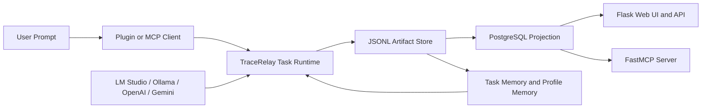
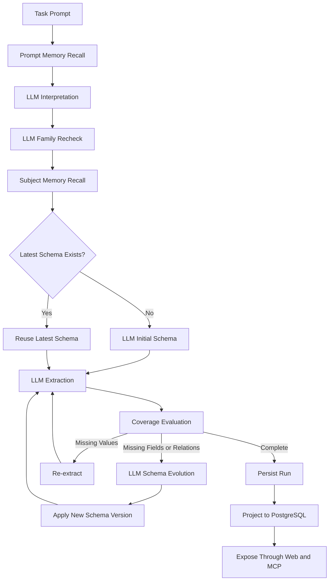

# Architecture

This document explains the runtime, persistence model, and surface area of TraceRelay in a form suitable for public documentation.

## System Context



## End-to-End Runtime



## Decision Tree

```text
Task
├─ Prompt arrives
├─ Retrieve prior memory
│  ├─ profile memory
│  ├─ prompt-adjacent memory
│  └─ subject memory
├─ Interpret task with LLM
│  ├─ intent
│  ├─ subject
│  ├─ initial family
│  ├─ requested fields
│  └─ requested relations
├─ Recheck family with LLM
│  ├─ compare requested schema shape
│  ├─ keep or revise family
│  └─ record review rationale
├─ Resolve schema
│  ├─ reuse latest schema for family
│  └─ or generate initial schema
├─ Extract
│  ├─ generate payload
│  └─ persist extraction attempt
├─ Evaluate coverage
│  ├─ if nothing is missing
│  │  └─ finish task
│  ├─ if values are missing
│  │  └─ re-extract
│  └─ if structure is missing
│     ├─ build gap
│     ├─ build requirement
│     ├─ ask LLM for additive schema
│     ├─ persist schema version
│     └─ extract again
└─ Publish
   ├─ JSONL lineage
   ├─ PostgreSQL browse model
   ├─ Flask UI and APIs
   └─ MCP tools and resources
```

## Artifact Lineage

The runtime stores a task as a sequence of typed artifacts.

```text
task_prompt
task_memory_context
task_interpretation
schema_reference or schema_version
task_extraction
coverage_report
schema_gap
schema_requirement
schema_candidate
schema_review
task_event
task_run
memory_document
user_profile
```

This means the final output is never detached from the reasoning path that produced it.

## Memory Model

TraceRelay's memory system is not generic chat memory. It is task-native memory.

### Memory types

- `task_summary`
- `subject_memory`
- `extraction_snapshot`
- `task_memory_context`
- `user_profile`

### Retrieval behavior

Memory is used twice in the loop:

1. before interpretation
2. after interpretation, once subject and family are known

That makes the second retrieval more precise than plain prompt similarity.

## Persistence Model

### Source of truth

- JSONL artifact store

### Query layer

- PostgreSQL projection

### Human and tool surfaces

- Flask pages and JSON APIs
- FastMCP server on HTTP `/mcp`

The projection is exact-task based and does not depend on task ID prefixes.

## Surface Inventory

### Web

- `/tasks`
- `/tasks/<task_id>`
- `/memory`
- `/memory/profile/<profile_id>`
- `/memory/subjects/<subject>`
- `/memory/tasks/<task_id>`

### API

- `/api/tasks`
- `/api/tasks/<task_id>`
- `/api/tasks/<task_id>/coverage`
- `/api/tasks/<task_id>/schema`
- `/api/tasks/<task_id>/events`
- `/api/tasks/<task_id>/trace`
- `/api/memory/search?q=<query>&subject=<subject>`
- `/api/memory/profile`
- `/api/memory/subjects/<subject>`
- `/api/memory/tasks/<task_id>`

### MCP Tools

- `task_evolve`
- `continue_prior_work`
- `structure_subject`
- `inspect_latest_changes`
- `task_trace`
- `schema_status`
- `schema_apply`
- `artifact_read`
- `artifact_search`
- `memory_search`
- `memory_profile`
- `subject_memory`
- `task_memory_context`

## Verified Example

The repository currently includes a live-verified Google task that:

- resolved subject as `Google`
- resolved family as `organization`
- completed successfully
- evolved to schema version `2`
- is discoverable through Web and MCP memory search

`inspect_latest_changes` now also surfaces family review state through:

- `family_changed`
- `initial_family`
- `final_family`
- `family_review_rationale`
- any `family_revised` task event

## Notes On Git Hygiene

This repository needed a new `.gitignore` because generated files were not being ignored consistently.

The new ignore file prevents future accidental additions of:

- Python caches
- local virtualenvs
- test caches
- local workspaces
- output folders
- egg-info and build metadata

If you want a fully clean repository state, the already tracked generated files should be removed from version control in a follow-up cleanup change.
