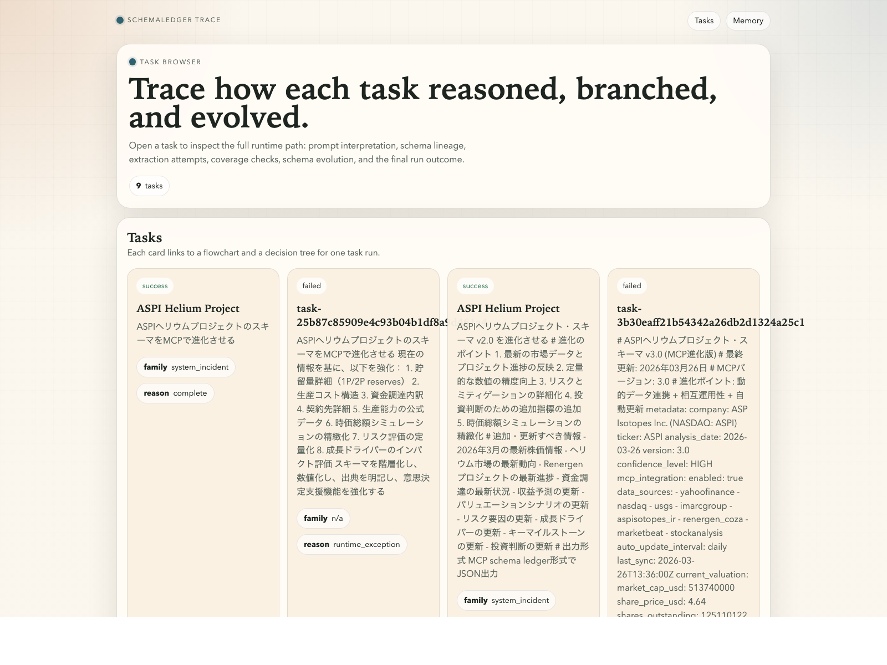
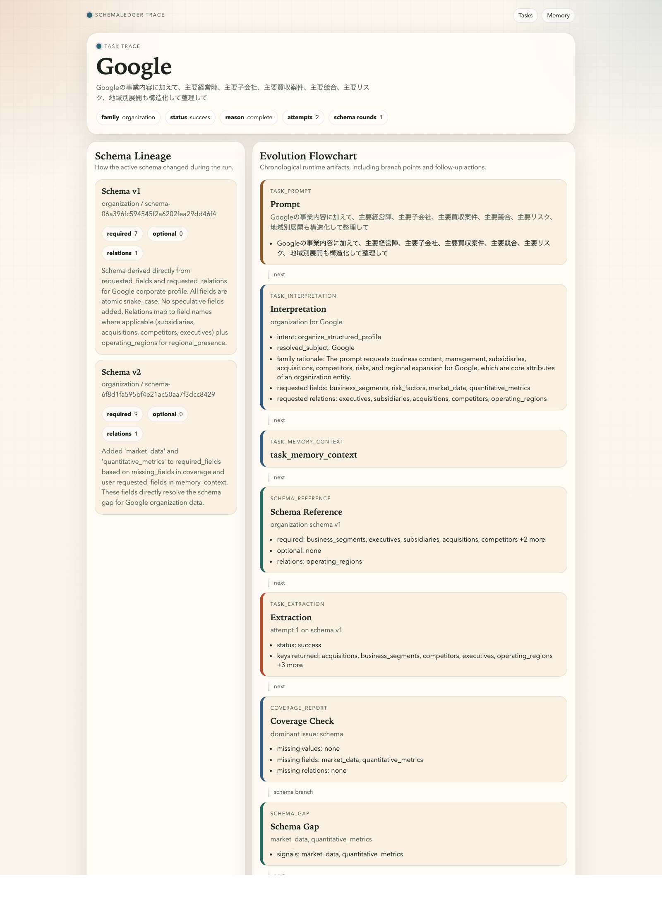

# Public Overview

SchemaLedger is a local-first runtime for structured research and schema evolution.

It does not treat extraction as a one-shot prompt. Instead, it treats every request as a task that can:

- interpret itself,
- decide or reuse a schema family,
- extract data,
- detect missing values,
- detect missing structure,
- evolve the schema,
- re-run extraction,
- persist the full lineage for review.

## Why This Matters

Most structured extraction systems assume the schema is already known.

SchemaLedger is built for the harder case:

- the user asks for new structure mid-task,
- the LLM discovers new fields or relations are needed,
- you still want traceability instead of hidden tool magic,
- you want the result to be stored, browsable, searchable, and reusable.

That combination is the system's real advantage.

## Strengths

### 1. Self-evolving schema loop

The runtime can add new keys and relations when the current schema is insufficient.

### 2. Full lineage, not just final payload

Every major step is stored:

- prompt
- interpretation
- schema version
- extraction attempts
- coverage reports
- schema gaps and candidates
- events
- final task result

### 3. Shared core across all surfaces

The same runtime state is reflected in:

- JSONL artifacts
- PostgreSQL projections
- Flask pages and APIs
- MCP tools and resources

### 4. Memory is built in

The system can recall:

- prior tasks
- subject memory
- user profile memory
- task memory context
- prior extraction snapshots

### 5. Local-first deployment

This repository is built around:

- LM Studio
- PostgreSQL via Docker Compose
- Flask
- FastMCP

That makes the system easy to inspect, run offline, and adapt.

## What The UI Shows

### Task List

The task list is the operational front page for the runtime. It shows subjects, families, and final task status.

### Task Trace

The trace page shows how a task evolved, including schema lineage, runtime flowchart, and decision tree.

## Typical Use Cases

- iterative company and market research
- schema growth during long-running investigation
- memory-backed follow-up analysis
- internal knowledge capture with traceable extraction
- MCP-backed local assistants that need persistent structure

## Live-Verified State In This Repo

This repository has already been run live with:

- LM Studio for generation and embeddings
- PostgreSQL on `127.0.0.1:55432`
- Flask on `127.0.0.1:5080`
- MCP SSE on `127.0.0.1:5063`

Google task recall is currently verified through:

- Web memory search
- PostgreSQL-backed browse
- direct MCP `memory_search("Google")`

## Related Docs

- [Architecture](./ARCHITECTURE.md)
- [Main README](../README.md)
